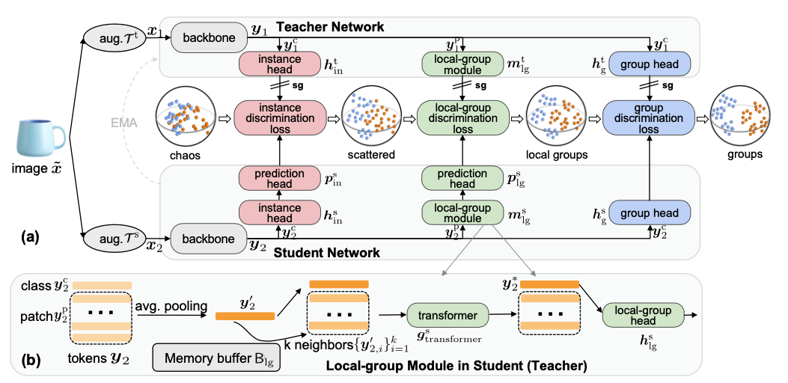
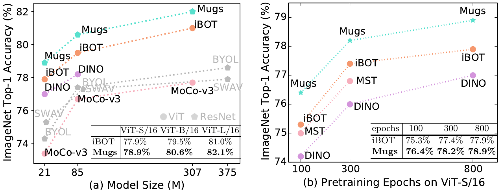
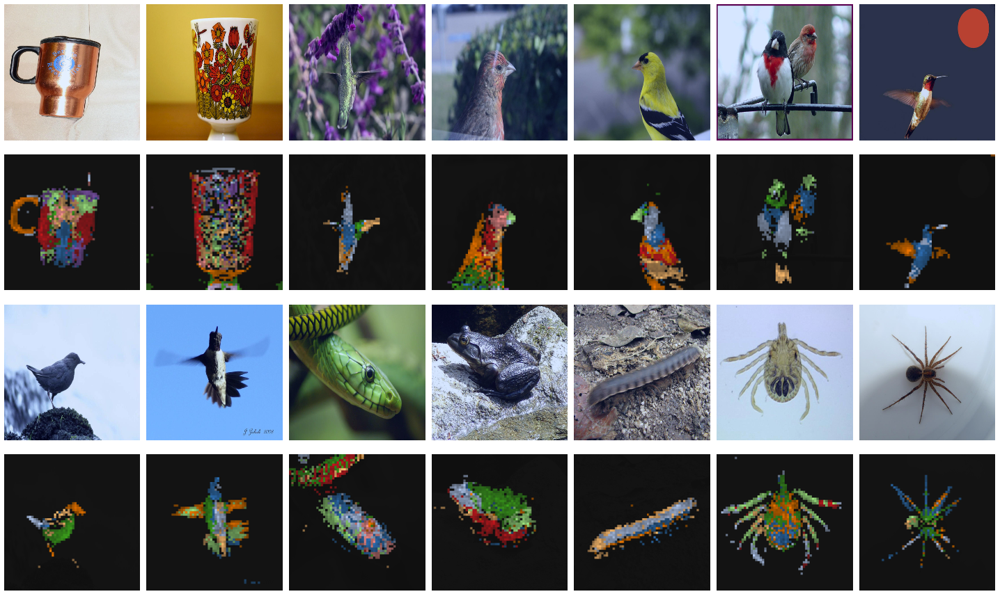
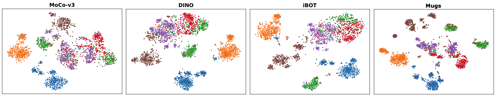

# Mugs: A Multi-Granular Self-Supervised Learning Framework

This is a PyTorch implementation of **Mugs** proposed by our paper "**Mugs: A Multi-Granular Self-Supervised Learning Framework**". [](http://arxiv.org/abs/2203.14415)

# [Rank 1 Linear Probing and KNN Classification Results on ImageNet Without Extra Training Data](https://paperswithcode.com/sota/self-supervised-image-classification-on?p=mugs-a-multi-granular-self-supervised)

<div align="center">

</div>

**<p align="center">Fig 1. Overall framework of Mugs.** In (a), for each image, two random crops of one image 
are fed into backbones of student and teacher. Three granular supervisions: 1) instance discrimination supervision, 2) local-group discrimination 
supervision, and 3) group discrimination supervision, are adopted to learn multi-granular representation. In (b), local-group modules in 
student/teacher averages all patch tokens, and finds top-k neighbors from memory buffer to aggregate them with the average for obtaining a local-group feature.</p>


# Pretrained models on ImageNet-1K

You can choose to download only the weights of the pretrained backbone used for downstream tasks, or the full checkpoint which contains backbone and projection head weights for both student and teacher networks.
**<p align="center">Table 1. KNN and linear probing performance with their corresponding hyper-parameters, logs and model weights.</p>**
<table>
  <tr>
    <th>arch</th>
    <th>params</th>
    <th>pretraining epochs</th>
    <th>k-nn</th>
    <th>linear</th>
    <th colspan="6">download</th>
  </tr>
  <tr>
    <td>ViT-S/16</td>
    <td>21M</td>
    <td>100</td>
    <td>72.3%</td>
    <td>76.4%</td>
    <td><a href="https://huggingface.co/zhoupans/Mugs/tree/main/pretrained%20models/vit_small_100ep">backbone only</a></td>
    <td><a href="https://huggingface.co/zhoupans/Mugs/tree/main/pretrained%20models/vit_small_100ep">full ckpt</a></td>
    <td><a href="https://huggingface.co/zhoupans/Mugs/tree/main/pretrained%20models/vit_small_100ep">args</a></td>
    <td><a href="https://huggingface.co/zhoupans/Mugs/tree/main/pretrained%20models/vit_small_100ep">logs</a></td>
    <td><a href="https://huggingface.co/zhoupans/Mugs/tree/main/pretrained%20models/vit_small_100ep">eval logs</a></td>
  </tr>
  <tr>
    <td>ViT-S/16</td>
    <td>21M</td>
    <td>300</td>
    <td>74.8%</td>
    <td>78.2%</td>
    <td><a href="https://huggingface.co/zhoupans/Mugs/tree/main/pretrained%20models/vit_small_300ep">backbone only</a></td>
    <td><a href="https://huggingface.co/zhoupans/Mugs/tree/main/pretrained%20models/vit_small_300ep">full ckpt</a></td>
    <td><a href="https://huggingface.co/zhoupans/Mugs/tree/main/pretrained%20models/vit_small_300ep">args</a></td>
    <td><a href="https://huggingface.co/zhoupans/Mugs/tree/main/pretrained%20models/vit_small_300ep">logs</a></td>
    <td><a href="https://huggingface.co/zhoupans/Mugs/tree/main/pretrained%20models/vit_small_300ep">eval logs</a></td>
  </tr>
  <tr>
    <td>ViT-S/16</td>
    <td>21M</td>
    <td>800</td>
    <td>75.6%</td>
    <td>78.9%</td>
    <td><a href="https://huggingface.co/zhoupans/Mugs/tree/main/pretrained%20models/vit_small_800ep">backbone only</a></td>
    <td><a href="https://huggingface.co/zhoupans/Mugs/tree/main/pretrained%20models/vit_small_800ep">full ckpt</a></td>
    <td><a href="https://huggingface.co/zhoupans/Mugs/tree/main/pretrained%20models/vit_small_800ep">args</a></td>
    <td><a href="https://huggingface.co/zhoupans/Mugs/tree/main/pretrained%20models/vit_small_800ep">logs</a></td>
    <td><a href="https://huggingface.co/zhoupans/Mugs/tree/main/pretrained%20models/vit_small_800ep">eval logs</a></td>
  </tr>
  <tr>
    <td>ViT-B/16</td>
    <td>85M</td>
    <td>400</td>
    <td>78.0%</td>
    <td>80.6%</td>
    <td><a href="https://huggingface.co/zhoupans/Mugs/tree/main/pretrained%20models/vit_base_400ep">backbone only</a></td>
    <td><a href="https://huggingface.co/zhoupans/Mugs/tree/main/pretrained%20models/vit_base_400ep">full ckpt</a></td>
    <td><a href="https://huggingface.co/zhoupans/Mugs/tree/main/pretrained%20models/vit_base_400ep">args</a></td>
    <td><a href="https://huggingface.co/zhoupans/Mugs/tree/main/pretrained%20models/vit_base_400ep">logs</a></td>
    <td><a href="https://huggingface.co/zhoupans/Mugs/tree/main/pretrained%20models/vit_base_400ep">eval logs</a></td>
  </tr>
  <tr>
    <td>ViT-L/16</td>
    <td>307M</td>
    <td>250</td>
    <td>80.3%</td>
    <td>82.1%</td>
    <td><a href="https://huggingface.co/zhoupans/Mugs/tree/main/pretrained%20models/vit_large_250ep">backbone only</a></td>
    <td><a href="https://huggingface.co/zhoupans/Mugs/tree/main/pretrained%20models/vit_large_250ep">full ckpt</a></td>
    <td><a href="https://huggingface.co/zhoupans/Mugs/tree/main/pretrained%20models/vit_large_250ep">args</a></td>
    <td><a href="https://huggingface.co/zhoupans/Mugs/tree/main/pretrained%20models/vit_large_250ep">logs</a></td>
    <td><a href="https://huggingface.co/zhoupans/Mugs/tree/main/pretrained%20models/vit_large_250ep">eval logs</a></td>
  </tr>
</table>

<div align="center">
  
</div>

**<p align="center">Fig 2. Comparison of linear probing accuracy on ImageNet-1K.**</p>

## Pretraining Settings

### Environment
For reproducing, please install [PyTorch](https://pytorch.org/) and download the [ImageNet](https://imagenet.stanford.edu/) dataset.
This codebase has been developed with python version 3.8, PyTorch version 1.7.1, CUDA 11.0 and torchvision 0.8.2. For the full 
environment, please refer to our `Dockerfile` file. 


### ViT pretraining :beer:
To pretraining each model, please find the exact hyper-parameter settings at the `args` column of  [Table 1](https://github.com/sail-sg/mugs). For training log and linear probing log, please refer to the 
`log` and `eval logs` column of [Table 1](https://github.com/sail-sg/mugs). 

#### ViT-Small pretraining:
To run ViT-small for 100 epochs, we use two nodes of total 8 A100 GPUs (total 512 minibatch size) by using following command: 
```
python -m torch.distributed.launch --nproc_per_node=8 main.py --data_path DATASET_ROOT --output_dir OUTPUT_ROOT --arch vit_small 
--group_teacher_temp 0.04 --group_warmup_teacher_temp_epochs 0 --weight_decay_end 0.2 --norm_last_layer false --epochs 100
```
To run ViT-small for 300 epochs, we use two nodes of total 16 A100 GPUs (total 1024 minibatch size) by using following command:
```
python -m torch.distributed.launch --nproc_per_node=16 main.py --data_path DATASET_ROOT --output_dir OUTPUT_ROOT --arch vit_small 
--group_teacher_temp 0.07 --group_warmup_teacher_temp_epochs 30 --weight_decay_end 0.1 --norm_last_layer false --epochs 300
```
To run ViT-small for 800 epochs, we use two nodes of total 16 A100 GPUs (total 1024 minibatch size) by using following command:
```
python -m torch.distributed.launch --nproc_per_node=16 main.py --data_path DATASET_ROOT --output_dir OUTPUT_ROOT --arch vit_small 
--group_teacher_temp 0.07 --group_warmup_teacher_temp_epochs 30 --weight_decay_end 0.1 --norm_last_layer false --epochs 800
```

#### ViT-Base pretraining:
To run ViT-base for 400 epochs, we use two nodes of total 24 A100 GPUs (total 1024 minibatch size) by using following command:
```
python -m torch.distributed.launch --nproc_per_node=24 main.py --data_path DATASET_ROOT --output_dir OUTPUT_ROOT --arch vit_base 
--group_teacher_temp 0.07 --group_warmup_teacher_temp_epochs 50 --min_lr 2e-06 --weight_decay_end 0.1 --freeze_last_layer 3 --norm_last_layer 
false --epochs 400
```

#### ViT-Large pretraining:
To run ViT-large for 250 epochs, we use two nodes of total 40 A100 GPUs (total 640 minibatch size) by using following command:
```
python -m torch.distributed.launch --nproc_per_node=40 main.py --data_path DATASET_ROOT --output_dir OUTPUT_ROOT --arch vit_large 
--lr 0.0015 --min_lr 1.5e-4 --group_teacher_temp 0.07 --group_warmup_teacher_temp_epochs 50 --weight_decay 0.025 
--weight_decay_end 0.08 --norm_last_layer true --drop_path_rate 0.3 --freeze_last_layer 3 --epochs 250
```

## Evaluation
We are cleaning up the evalutation code and will release them when they are ready.

## Self-attention visualization
Here we provide the self-attention map of the [CLS] token on the heads of the last layer 
<div align="center">
  
</div>

**<p align="center">Fig 3. Self-attention from a ViT-Base/16 trained with Mugs.**</p>


## T-SNE visualization
Here we provide the T-SNE visualization of the learned feature by ViT-B/16. 
We show the fish classes in ImageNet-1K, i.e., the first six classes, 
including tench, goldfish, white shark, tiger shark, hammerhead, electric 
ray. See more examples in Appendix.
<div align="center">
  
</div>

**<p align="center">Fig 4. T-SNE visualization of the learned feature by ViT-B/16.**</p>

## License
This repository is released under the Apache 2.0 license as found in the [LICENSE](LICENSE) file.

## Citation
If you find this repository useful, please consider giving a star :star: and citation :beer::
```
@inproceedings{mugs2022SSL,
  title={Mugs: A Multi-Granular Self-Supervised Learning Framework},
  author={Pan Zhou and Yichen Zhou and Chenyang Si and Weihao Yu and Teck Khim Ng and Shuicheng Yan},
  booktitle={arXiv preprint arXiv:2203.14415},
  year={2022}
}
